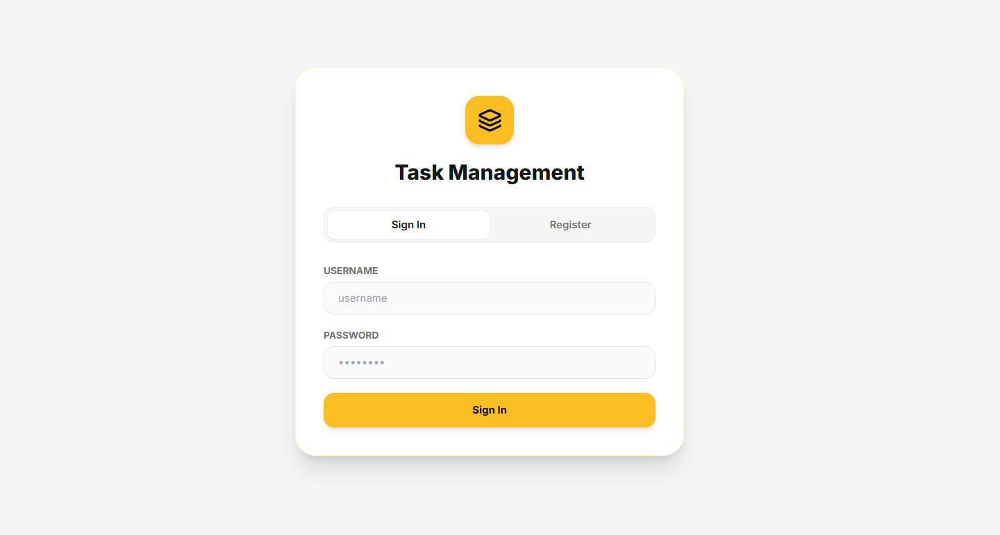
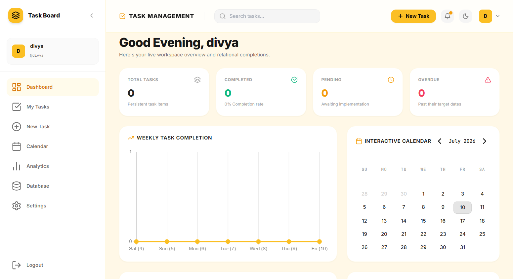
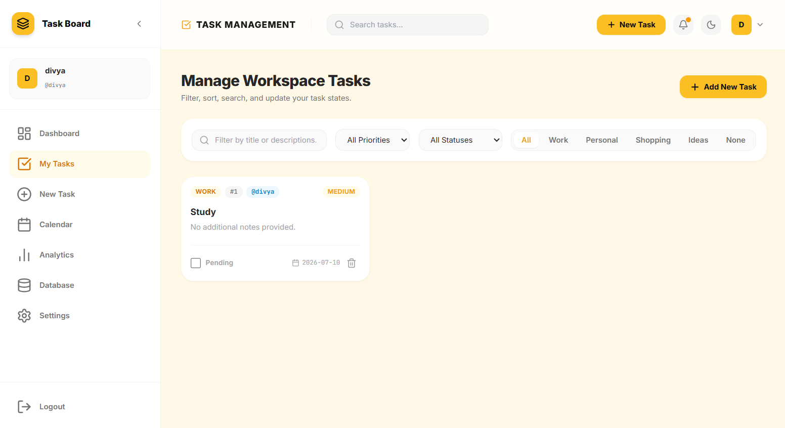
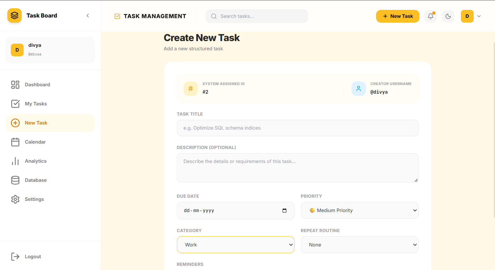
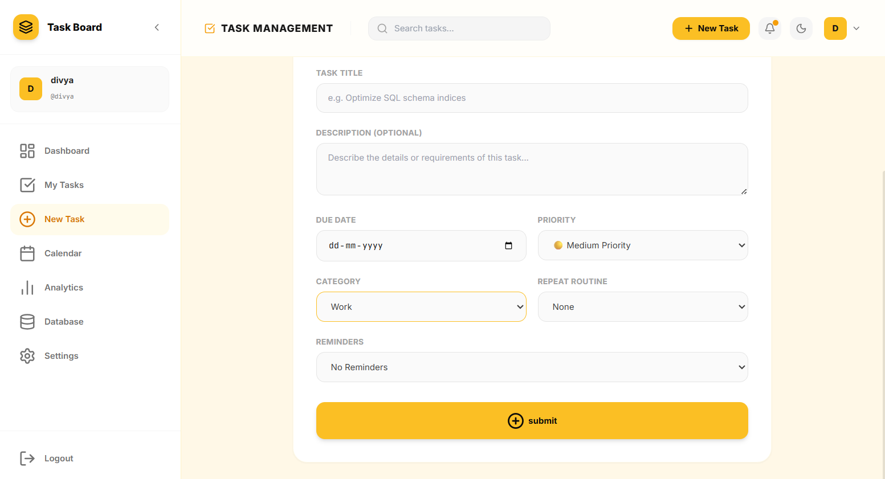
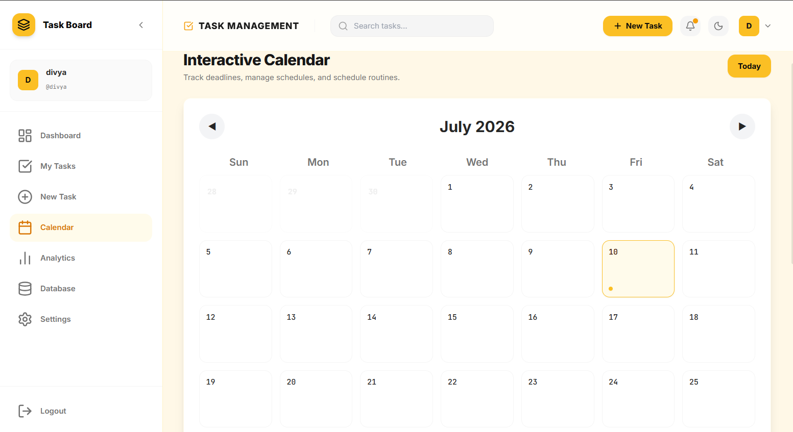
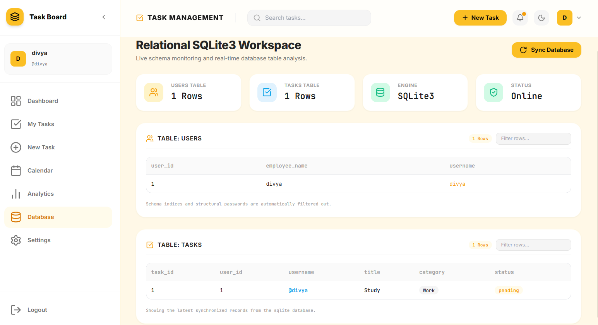
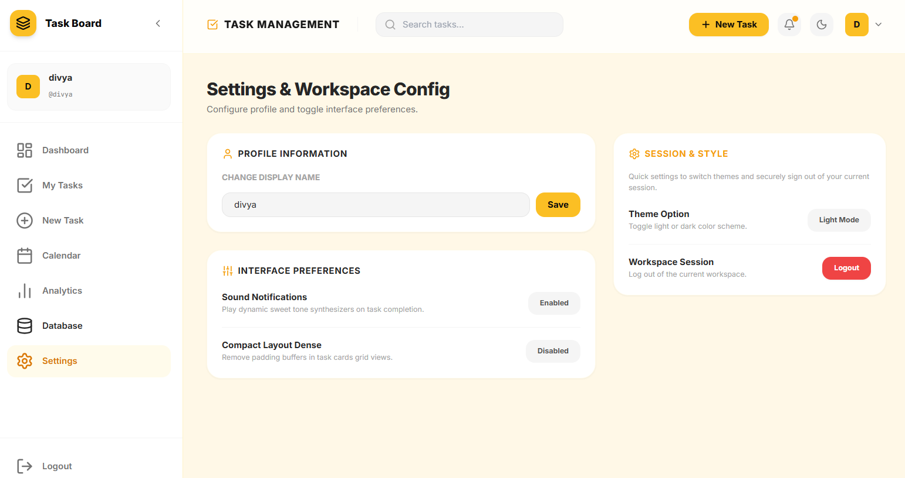

# 📋 Task Management
<p align="center">


</p>

## 📖 Overview

Task Management Dashboard is a full-stack web application built using **Python, HTML, CSS, JavaScript, and SQLite**. It helps users organize, track, and manage tasks efficiently through an intuitive interface with analytics, calendar integration, and secure authentication.

## ✨ Features
### 🔐 Authentication
- User Registration
- Secure Login
- Password Hashing
- Session Management

### ✅ Task Management
- Create Tasks
- Update Tasks
- Delete Tasks
- Search & Filter Tasks
- Priority & Category Management
- Task Status Tracking

### 📊 Dashboard
- Live Task Statistics
- Weekly Productivity Charts
- Recent Activity Feed
- Task Completion Overview

### 📅 Calendar
- Interactive Calendar
- Due Date Tracking
- Schedule Management

### 📈 Analytics
- Productivity Insights
- Category Distribution
- Weekly Completion Reports

### 🗄️ Database Explorer
- View Users Table
- View Tasks Table
- SQLite Database Monitoring

### ⚙️ Settings
- Profile Management
- Theme Switching
- Workspace Preferences

## 🛠️ Technology Stack
| Category | Technologies |
|-----------|--------------|
| 🎨 Frontend | HTML5, CSS3, JavaScript |
| ⚙️ Backend | Python |
| 🗄️ Database | SQLite |
| 📊 Charts | Chart.js |
| 🎯 Icons | Lucide Icons |
| 🔧 Version Control | Git & GitHub |

## 📂 Project Structure
```text
Task-Management-Dashboard/
│
├── app.py
├── auth.py
├── task.py
├── index.html
├── script.js
├── style.css
├── package.json
├── README.md
│
├── images1/
│   ├── login.png
│   ├── dashboard.png
│   ├── my_tasks.png
│   ├── create_task1.png
│   ├── create_task2.png
│   ├── calendar.png
│   ├── analytics.png
│   ├── database.png
│   └── settings.png
│
└── metadata.json
```

# 📸 Application Screenshots

## 🔐 Login

<p align="center">

</p>

---

## 📊 Dashboard

<p align="center">

</p>

---

## ✅ My Tasks

<p align="center">

</p>

---

## ➕ Create New Task

<p align="center">

</p>

<p align="center">

</p>

---

## 📅 Calendar

<p align="center">

</p>

---

## 📈 Analytics

<p align="center">

</p>

---

## 🗄️ Database Explorer

<p align="center">

</p>

---

## ⚙️ Settings

<p align="center">

</p>

## 🎯 Future Enhancements

- Google Authentication
- Email Notifications
- File Attachments
- Export Tasks (CSV/PDF)
- Cloud Database Integration
- Drag-and-Drop Task Board
- Mobile Responsive Improvements

## 📚 Learning Outcomes

- Full Stack Web Development
- Python Backend Development
- SQLite Database Design
- CRUD Operations
- Authentication & Authorization
- Dashboard Development
- Data Visualization
- Git & GitHub Workflow

## 👩‍💻 Author
DIVYA LOKWANI

**Divya Lokwani**

- GitHub: https://github.com/DIVYA03-TECH
- LinkedIn: *(Add your LinkedIn profile here)*
